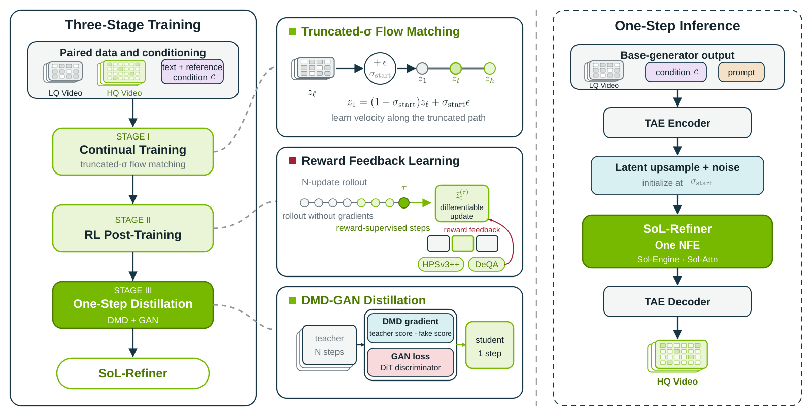

<div align="center">

# SoL-Refiner
### Speed-of-Light One-Step Refinement for High-Resolution Video

**Generate a draft. Refine once. Deliver high-resolution video.**

[**Project Page**](https://nvlabs.github.io/Sana/Sol-Refiner/) · [**Video Comparisons**](https://nvlabs.github.io/Sana/Sol-Refiner/#generator-samples) · [**Method**](#method) · [**Code & Models**](#code--models) · [**Citation**](#citation)

Haozhe Liu\*, Tian Ye\*, Shuchen Xue\*, Yitong Li, Junsong Chen, Haopeng Li,<br>
Jincheng Yu, Duomin Wang, Ruihua Zhang, Lei Zhu, Song Han, Enze Xie

**NVIDIA Research, Efficient AI Team & Singapore Lab.**<br>
<sub>* Equal contribution</sub>

</div>

[](#method)

<p align="center"><em>SoL-Refiner: three-stage training and one-step high-resolution refinement.<br>Original paper framework based on LTX-2.3 Refiner.</em></p>

## Overview

**SoL-Refiner turns low-resolution videos into high-resolution outputs with a single target-resolution denoising step.** A base generator first produces a low-resolution draft; SoL-Refiner then restores detail at the target resolution. This two-stage approach reduces the cost of generating every frame directly at high resolution while avoiding a second multi-step sampling bottleneck.

The project combines high-resolution continual training, reinforcement learning (RL) post-training and one-step distillation. The paper studies refinement up to **4K**, with bidirectional and streaming inference. The [project gallery](https://nvlabs.github.io/Sana/Sol-Refiner/#generator-samples) shows refinement across **SANA-Video, WAN, Cosmos-Nano and MiniMax H3**.

## Method

**The paper's training and inference pipeline.** Paired low- and high-quality videos train the refiner; reward feedback improves visual quality; distillation compresses the teacher into a one-step student. At inference, latent upsampling and noise initialize the refiner, while a tiny autoencoder and SoL-Engine reduce execution cost.

1. **High-resolution continual training** learns the refinement mapping from aligned low- and high-quality video pairs.
2. **Frame-based RL post-training** improves perceptual quality through visual reward feedback.
3. **One-step distribution-matching distillation** transfers the teacher's refinement behavior into a student that needs one denoising step.

The original paper builds on **LTX-2.3 Refiner**. The later **LTX-2.5 / MiniMax-H3 extension** described below adapts the approach for H3 enhancement and acceleration. Its implementation has its own runtime and checkpoint; the diagram above describes the paper's method.

## Results & Video Demos

### Refinement across base generators

[](https://nvlabs.github.io/Sana/Sol-Refiner/#results)

The project-page comparison reports lower two-stage latency and higher average quality for WAN and Cosmos-Nano on one H100 GPU. See the [results and measurement protocols](https://nvlabs.github.io/Sana/Sol-Refiner/#results) for the generator settings and output resolutions.

### High-resolution refinement

[](https://nvlabs.github.io/Sana/Sol-Refiner/#results)

One-step refinement remains competitive at 2K and improves both reported quality metrics over LTX-2.3 at 4K in the project-page comparison.

| Explore | What to see |
| --- | --- |
| [SANA-Video](https://nvlabs.github.io/Sana/Sol-Refiner/#sana-samples) | Human motion, portraits, costumes and landscapes |
| [WAN](https://nvlabs.github.io/Sana/Sol-Refiner/#wan-samples) | Facial details, animals, architecture and vehicles |
| [Cosmos-Nano](https://nvlabs.github.io/Sana/Sol-Refiner/#cosmos-samples) | Fine textures, portraits, fast motion and nature |
| [MiniMax H3](https://nvlabs.github.io/Sana/Sol-Refiner/#h3-samples) | H3 refinement comparisons |
| [H3 deployment demo](https://nvlabs.github.io/Sana/Sol-Refiner/#h3-case) | Two-stage acceleration with the deployment measurement protocol |

## Code & Models

**The paper uses LTX-2.3; the H3 implementation is a subsequent LTX-2.5 extension.** After LTX-2.5 Refiner became available, we developed a dedicated one-step variant for MiniMax-H3 video enhancement and acceleration. This extension is outside the original paper's LTX-2.3 experiments.

The refiner backbone and the base video generator are separate choices. SANA-Video, WAN, Cosmos-Nano and H3 produce the draft videos; LTX-2.3 or LTX-2.5 provides the refinement backbone.

| Version | Refiner backbone | Code entry | Availability |
| --- | --- | --- | --- |
| Original paper version | LTX-2.3 | [One-step & multi-step](LTX-2.3/) | Baseline and SoL-Engine inference; public checkpoints pending |
| MiniMax-H3 extension | LTX-2.5 | [MiniMax-H3](MiniMax-H3/) | One-step Diffusers inference available; public checkpoint pending |

**To run the original paper version**, follow [LTX-2.3 installation and inference](LTX-2.3/) for one-step and multi-step models, each with baseline and SoL-Engine execution.

**To run the H3 extension**, follow [MiniMax-H3 installation and inference](MiniMax-H3/). It accepts an existing H3 video and a prompt. The current release entry uses a complete local model package; we will add the official download location when the weights are published.

The project-page figures summarize the research and demonstrations. They are separate from benchmarks of this particular Diffusers implementation.

## Citation

```bibtex
@techreport{liu2026solrefiner,
  title       = {SoL-Refiner: Speed-of-Light One-Step Refinement for High-Resolution Video},
  author      = {Haozhe Liu and Tian Ye and Shuchen Xue and Yitong Li and
                 Junsong Chen and Haopeng Li and Jincheng Yu and Duomin Wang and
                 Ruihua Zhang and Lei Zhu and Song Han and Enze Xie},
  institution = {NVIDIA Research, Efficient AI Team \& Singapore Lab.},
  year        = {2026},
  note        = {Technical Report}
}
```

Visit the [project page](https://nvlabs.github.io/Sana/Sol-Refiner/) for paper-release updates, videos and results.
